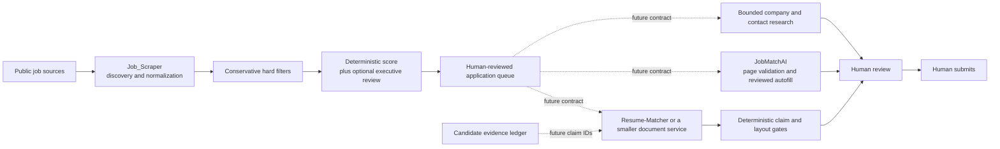

# Architecture Decision: Murat's Executive Job Search System

- **Status:** Accepted for Phase 1; later-phase interfaces remain proposed
- **Date:** 2026-09-10
- **Decider:** Murat Beshtoev
- **Scope:** Discovery, executive-fit prioritization, application assistance, research, and evidence-grounded document generation

## Context

The objective is a dependable, low-maintenance system that finds a small number of high-value executive opportunities worth Murat's time. The primary market is Toronto/GTA and Canada-remote, with a focus on VP, Head, Senior Director, and Chief-level mandates across Data, AI, Analytics, Finance/FP&A, governance, enterprise platforms, automation, and transformation.

The system must optimize for mandate fit rather than title or keyword density. In particular, a Director role is relevant only when its decision authority, enterprise scope, executive stakeholders, and operating-model ownership are comparable to the target band.

Three customized repositories already address different parts of this workflow:

- [Job_Scraper](https://github.com/beshtoev/Job_Scraper) discovers, normalizes, deduplicates, scores, and presents opportunities.
- [JobMatchAI](https://github.com/beshtoev/JobMatchAI) assists on a job page with a second opinion, reviewed form filling, and lightweight notes.
- [Resume-Matcher](https://github.com/beshtoev/Resume-Matcher) supports high-value resume and application-document work.

They are complementary products with different runtimes and maintenance profiles. Combining their source trees would create a Python scraper, scheduled GitHub workflows, a browser extension, a FastAPI service, a Next.js application, SQLite, Playwright, and several AI-provider integrations before discovery quality is proven.

## Decision drivers

1. High recall for genuinely relevant Toronto/GTA executive mandates.
2. Strong precision after ranking, including detection of inflated titles and individual-contributor roles.
3. Evidence-grounded outputs that never turn a job requirement into a candidate claim.
4. A human decision before any form change, document use, outreach, or submission.
5. Clear ownership of data and behavior across independently maintainable components.
6. Local-first handling of candidate material and explicit disclosure of every external data transfer.
7. Reproducible scoring, observable source health, and low-cost re-evaluation.
8. The smallest architecture that proves useful before more automation is added.

## Decision

Keep **Job_Scraper as the Phase 1 foundation and system of record for discovery and prioritization**. Do not integrate JobMatchAI, Resume-Matcher, career-ops, SimplyApply, or Tailored into the Phase 1 runtime.

Keep JobMatchAI and Resume-Matcher as separate applications. If later phases earn their complexity, connect them with small, versioned data contracts rather than shared storage, imported source trees, or duplicated trackers.

The intended long-term flow is:



Dashed connections are future options, not Phase 1 integrations.

## Phase 1 architecture

### Responsibilities

Job_Scraper owns:

- scheduled collection from enabled job sources;
- normalization into a common job shape;
- cross-source identity and deduplication;
- conservative title and geography filtering;
- deterministic, explainable ranking;
- optional LLM-assisted executive-fit review;
- a browser dashboard for human triage; and
- source-health, scoring, and regression checks.

Job_Scraper does **not** own:

- resume or cover-letter generation;
- candidate fact storage beyond the minimum private profile needed for scoring;
- browser autofill;
- company/contact research;
- durable application lifecycle management across devices; or
- application submission.

### Current data flow

```text
source adapters
    -> normalized per-source snapshots
    -> URL/content deduplication
    -> output/all_jobs.json (rolling 30-day discovery master)
    -> deterministic scoring_profile score
       and/or output/scores.json LLM verdict
    -> triage.html
    -> human save / dismiss / apply decision
```

`output/all_jobs.json` is the canonical Phase 1 discovery set for its rolling window. Per-source files are replaceable snapshots, and `output/scores.json` is derived data that must be safe to recompute.

Dashboard statuses, notes, ratings, and timeline events currently live in browser `localStorage`. They are convenient personal state, not a durable or cross-device application system of record. CSV export is a backup/handoff mechanism, not transactional persistence.

### Required Phase 1 boundaries

- Candidate profile, resume, provider keys, and private notes must not be committed to a public repository.
- Job descriptions are untrusted input. They may inform evaluation but never instruct the agent or grant tools.
- Collection must fail soft: one blocked source cannot erase previous valid results or fail the whole discovery run.
- Deduplication must preserve source provenance and enrich an existing record instead of discarding better fields.
- A failed model call is an error to retry, never a negative fit judgment.
- Expensive model evaluation should occur only after normalization, deduplication, basic eligibility checks, and a liveness check where practical.
- Every score must identify its rubric version, evaluation time, input coverage (`full-description` or `metadata-only`), and concise supporting/rejecting signals.
- Location, work authorization, compensation, and mandate level are explicit decision fields. They must not be hidden inside an opaque aggregate score.
- No action outside discovery and prioritization is automatic in Phase 1.

### Known Phase 1 gaps found during this review

The repository has a personalized `config.json` for Toronto/GTA executive discovery, but several fallbacks still describe the upstream environmental/toxicology use case:

1. No local `scoring_profile.json` is present. The dashboard therefore retains its embedded environmental scoring rules, while notifications load the environmental `scoring_profile.example.json`.
2. `triage_agent.py` still emits environmental/toxicology role families rather than Murat's executive mandate families.
3. `notify.py` retains environmental defaults when personalized scoring/topic configuration is unavailable.
4. `murat_config.json` is a plain-text planning brief, not valid JSON, and no runtime code reads it. `config.json` is the actual search configuration.
5. The main README is upstream-oriented and repeatedly describes the environmental example. That is acceptable as upstream documentation only if Murat's runtime configuration and operator guide make the distinction unmistakable.
6. The 30-day discovery master and browser-local workflow state do not yet constitute a durable application history.

These are Phase 1 calibration and documentation issues. They do not justify importing another application.

## Component boundaries after Phase 1

| Component | Intended ownership | Explicit non-responsibilities |
|---|---|---|
| **Job_Scraper** | Discovery, normalization, dedupe, source health, executive ranking, queue selection | Document generation, form filling, submission |
| **JobMatchAI** | User-invoked page extraction, second-pass fit review, reviewed field suggestions, optional convenience notes | Broad discovery, authoritative score, canonical application history, automatic submission |
| **Resume-Matcher or smaller document service** | Master-profile-based tailoring, previews, DOCX/PDF, cover letter, interview materials | Discovery, crawling, authoritative application tracking |
| **Research module** | Bounded company, role, and contact research for selected opportunities | Continuous crawling, enrichment of every discovered role, unreviewed outreach |
| **Candidate evidence ledger** | Private, approved facts and provenance used by all generated candidate-facing content | Job requirements, inferred achievements, or generated prose treated as facts |

No component may write directly to another component's database. Cross-component operations must be explicit, one-way where possible, idempotent, and reviewable.

## Future interoperability contract

The first integration, if Phase 1 succeeds, should be a small exported **application candidate** record. A conceptual schema is:

```json
{
  "schema_version": "1.0",
  "job_id": "stable-source-independent-id",
  "canonical_url": "https://employer.example/job/123",
  "source_urls": ["https://board.example/job/456"],
  "company": "Example Company",
  "title": "VP, Data and AI",
  "location": "Toronto, ON",
  "work_arrangement": "hybrid",
  "description_hash": "sha256:...",
  "description_captured_at": "2026-09-10T12:00:00Z",
  "score": {
    "value": 91,
    "rubric_version": "executive-fit-v1",
    "coverage": "full-description",
    "supporting_signals": ["enterprise AI mandate", "C-suite sponsorship"],
    "risk_flags": ["compensation not published"]
  },
  "selected_by_user_at": "2026-09-10T12:15:00Z"
}
```

The production schema must avoid embedding resume content, API keys, free-form private notes, or generated claims. A downstream tool should reject unsupported schema versions and duplicate `job_id` operations safely.

Application status may flow back later as append-only events (`opened`, `drafted`, `submitted`, `interview`, `closed`) with an event ID and timestamp. JobMatchAI's local tracker must remain a convenience log until such a contract exists.

## Truthfulness architecture for future document generation

A prompt that says “do not fabricate” is necessary but not sufficient. Candidate-facing content must pass a deterministic write/export gate.

### Evidence ledger

Maintain a private structured master profile whose claims have stable identifiers and provenance, for example:

```json
{
  "claim_id": "achievement.finance_close_cycle.v1",
  "claim_type": "achievement",
  "statement": "Approved candidate fact in source wording",
  "value": 25,
  "unit": "percent",
  "scope": "approved business context",
  "source_document": "master-resume.docx",
  "source_locator": "Experience 2, bullet 3",
  "verification": "candidate-approved"
}
```

Generated resume bullets, letters, outreach, and application answers should cite the `claim_id` values they use. Rendering may omit those IDs from the final document, but the saved generation record must retain them for audit and regeneration.

### Validation rules

The export gate must:

- exact-match identity facts such as employer, title, institution, credential, certification, and dates;
- validate every number together with unit and context, including small counts such as team size;
- allow a skill only through an approved skill/claim identifier, not substring presence in an unstructured resume corpus;
- validate executive-scope claims such as team size, budget, geography, reporting line, ownership, and transformation impact;
- distinguish authored, led, sponsored, advised, contributed, and used—tool usage is not authorship;
- prevent job-description content from becoming candidate evidence;
- reject unknown or ambiguous claims before state mutation or export;
- report exact violations, permit a bounded correction attempt, and then fail closed to the last approved document; and
- require explicit user approval for a new or corrected fact before it enters the evidence ledger.

This is stricter than any single reviewed reference implementation. SimplyApply provides the strongest compact fail-closed pattern but ignores standalone numeric tokens from 0 through 10 and uses substring matching for skills. Tailored correctly puts structural validation on the write path, but its current `verify_truthfulness()` checks experience identity, education, and certification—not bullet claims, metrics, projects, or skills. Those designs are useful starting points, not complete executive-resume protection.

## Reference architectures reviewed

The observations below are pinned to the inspected revisions so future changes in those repositories do not silently change this decision.

| Reference | Inspected revision | Reusable concepts | Do not copy wholesale |
|---|---|---|---|
| [career-ops](https://github.com/career-ops-hq/career-ops) | `da8c6f9193ac3d7a48a583f815b7d0feab742b81` | Human-in-the-loop rule; public ATS provider boundary; liveness before model spend; structured evaluation reports; user/system file separation; provenance checks; derived indexes | Large prompt/script surface, its full tracker/generator, or its file layout without a demonstrated need |
| [JobMatchAI fork](https://github.com/beshtoev/JobMatchAI) | `55b46b87910a4b90ce3d6fdacb30771a69a01bd0` | Page-level extraction; review-before-fill; BYO model; executive second opinion | Broad all-site browser permissions, duplicate tracker ownership, upstream H1B dependency, or automatic authority |
| [Resume-Matcher fork](https://github.com/beshtoev/Resume-Matcher) | `348fa41df9f8a9489d0df9ede1afca296ba76c6b` | Structured resume workflow; previews/confirmation; multi-provider support; document rendering and reliability tests | Full FastAPI/Next.js/SQLite/Playwright application inside Job_Scraper |
| [SimplyApply](https://github.com/artbyjazi/simply-apply) | `f85b81878530eff373ae1dd48b93bd84eada934a` | Code-level allowlist, violation-specific retry, fail closed to base resume | Small-number exemption, substring skill validation, entire search/application stack |
| [Tailored](https://github.com/end1989/tailored) | `95749e760bbfd32abda437f80969ff96cd0ff211` | Master profile; server-side write gate; explicit pipeline states; `needs_paste`; agent-facing tool contracts; idempotent handling | Treating structural identity checks as proof that all generated prose is supported |

Additional conclusions from the review:

- career-ops' human-readable canonical files are a good portability pattern, but Job_Scraper already has a simple JSON contract; changing formats during Phase 1 would add migration risk without improving discovery.
- Resume-Matcher's current fork uses SQLite; references to TinyDB describe a legacy storage generation and should not drive current architecture decisions.
- JobMatchAI is strategically useful only after a role has passed discovery and prioritization. Its score is a second opinion and must not overwrite Job_Scraper's score implicitly.
- Company/contact research should be performed only for user-selected roles. Researching every scraped listing would add cost, privacy exposure, and stale data without helping Phase 1 recall.

## Options considered

| Option | Benefits | Costs and risks | Decision |
|---|---|---|---|
| Merge JobMatchAI and Resume-Matcher into Job_Scraper now | One apparent product surface | Large mixed stack, duplicated state, coupled releases, security/permission expansion, slower discovery learning | Rejected |
| Replace Job_Scraper with career-ops | Mature end-to-end concepts and agent workflows | Migration cost, overlapping capability, loss of focused scraper investments, still requires personal calibration | Rejected for Phase 1 |
| Rebuild selected downstream features inside Job_Scraper | Full control and potentially fewer apps | Premature product work, recreates browser/document complexity, increases test burden | Rejected for Phase 1 |
| Keep bounded components and add contracts only after evidence | Preserves specialization, limits blast radius, supports replaceability | Some manual handoff and later contract design | **Selected** |
| Use a managed all-in-one service | Lower maintenance for autofill/tracking | Cloud data, subscription cost, generic scoring, limited evidence controls, platform lock-in | Contingency, not current core |

## Trade-offs and consequences

### Positive

- Phase 1 effort stays concentrated on finding the right opportunities.
- Each application can evolve or be replaced independently.
- Browser permissions and document-generation dependencies do not expand the scraper's attack surface.
- Human approval remains an architectural boundary rather than a UI preference.
- Future integrations can be tested against versioned records and replayed safely.
- Truthfulness becomes a mechanical contract, not a model-quality assumption.

### Negative

- The near-term workflow includes manual handoffs between discovery, browser, and document tools.
- Status and notes remain device-local until a later durable tracker decision.
- Separate components can show inconsistent scores until score ownership and display rules are implemented.
- A rigorous evidence ledger requires candidate review and initial data preparation.
- ATS browser automation will always carry ongoing maintenance if JobMatchAI is adopted.

## Phase plan and gates

### Phase 1 — prove discovery and prioritization

Allowed work:

- calibrate all runtime filters, role families, scoring rules, and notifications to Murat's target mandate;
- define a labeled set of representative good, borderline, and poor-fit postings;
- measure false negatives, top-of-queue precision, duplicate rate, stale-post rate, and source failures;
- add liveness and coverage indicators before optional model scoring;
- make score rationale, rubric version, and metadata-only evaluation visible; and
- document/verify private-versus-public data handling.

Exit criteria:

- a personalized deterministic scoring profile is active, tested, and never falls back silently;
- the LLM role taxonomy and examples represent Data/AI/Analytics, Finance/FP&A, governance, platform, and transformation leadership;
- representative labels show useful separation among apply-now, review, and reject cases;
- Toronto/GTA and Canada-remote source coverage is reliable enough to review daily;
- a blocked or empty source cannot wipe valid results;
- duplicate and stale-post rates are understood; and
- one week of normal use shows the queue saves time instead of creating review noise.

### Phase 2 — contract-only handoff

Add an export/open action for user-selected roles. Pilot JobMatchAI as an optional page-level copilot. Do not create two-way tracker synchronization until manual duplication is demonstrably costly.

### Phase 3 — guarded documents

Choose between the separate Resume-Matcher application and a smaller document service. Introduce the candidate evidence ledger and deterministic claim gate before relying on generated executive claims. Validate DOCX/PDF content, layout, and ATS extraction independently.

### Phase 4 — selective execution assistance

Pilot reviewed autofill on representative Greenhouse, Lever, and Workday applications. Reduce browser permissions if testing shows on-demand injection is practical. Preserve the rule that only Murat submits.

## Action items

- [ ] Create and validate Murat's private `scoring_profile.json`; remove silent use of the environmental example in his runtime.
- [ ] Replace the environmental role taxonomy and prompt assumptions in the optional LLM triage path.
- [ ] Rename or retire the unused `murat_config.json` planning brief so it cannot be mistaken for runtime configuration.
- [ ] Create a labeled executive-job evaluation fixture set and record precision/recall-oriented results.
- [ ] Add source-liveness and input-coverage reporting before increasing automation.
- [ ] Decide how to back up or migrate browser-local application state after Phase 1.
- [ ] Draft the versioned application-candidate schema only when the Phase 2 pilot begins.
- [ ] Build the evidence ledger and claim validator before automated document handoff.
- [ ] Pilot JobMatchAI and Resume-Matcher independently; do not merge either repository into Job_Scraper.

## Non-goals

- Applying automatically or bypassing an employer's controls.
- Scraping authenticated sources with personal sessions during Phase 1.
- Maximizing the number of applications.
- Treating keyword similarity as executive fit.
- Inferring candidate experience from a job description.
- Making one repository responsible for every stage of the job search.
