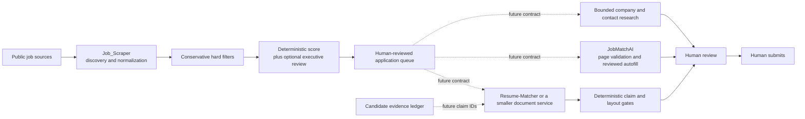

# Architecture Decision: Murat's Executive Job Search System

- **Status:** Accepted for the discovery system (Phases 1–3); later-phase interfaces remain proposed
- **Date:** 2026-09-10 (revision 2, same day — see [Revision history](#revision-history))
- **Decider:** Murat Beshtoev
- **Scope:** Discovery, executive-fit prioritization, application assistance, research, and evidence-grounded document generation
- **Deployment state:** Not deployed. All Murat-specific work is on the local branch `codex/phase1-job-discovery`. Scheduled workflows on `main` still run the upstream environmental defaults, and GitHub Pages is not serving the dashboard.

## Context

The objective is a dependable, low-maintenance system that finds a small number of high-value executive opportunities worth Murat's time. The primary market is Toronto/GTA and Canada-remote, with a focus on VP, Head, Senior Director, and Chief-level mandates across Data, AI, Analytics, Finance/FP&A, governance, enterprise platforms, automation, and transformation.

The system must optimize for mandate fit rather than title or keyword density. In particular, a Director role is relevant only when its decision authority, enterprise scope, executive stakeholders, and operating-model ownership are comparable to the target band.

Three customized repositories already address different parts of this workflow:

- [Job_Scraper](https://github.com/beshtoev/Job_Scraper) discovers, normalizes, deduplicates, scores, and presents opportunities.
- [JobMatchAI](https://github.com/beshtoev/JobMatchAI) assists on a job page with a second opinion, reviewed form filling, and lightweight notes.
- [Resume-Matcher](https://github.com/beshtoev/Resume-Matcher) supports high-value resume and application-document work.

They are complementary products with different runtimes and maintenance profiles. Combining their source trees would create a Python scraper, scheduled GitHub workflows, a browser extension, a FastAPI service, a Next.js application, SQLite, Playwright, and several AI-provider integrations before discovery quality is proven.

## Decision drivers

1. High recall for genuinely relevant Toronto/GTA executive mandates.
2. Strong precision after ranking, including detection of inflated titles and individual-contributor roles.
3. Evidence-grounded outputs that never turn a job requirement into a candidate claim.
4. A human decision before any form change, document use, outreach, or submission.
5. Clear ownership of data and behavior across independently maintainable components.
6. Local-first handling of candidate material and explicit disclosure of every external data transfer.
7. Reproducible scoring, observable source health, and low-cost re-evaluation.
8. The smallest architecture that proves useful before more automation is added.

## Decision

Keep **Job_Scraper as the foundation and system of record for discovery and prioritization (Phases 1–3)**. Do not integrate JobMatchAI, Resume-Matcher, career-ops, SimplyApply, or Tailored into that runtime.

Keep JobMatchAI and Resume-Matcher as separate applications. If later phases earn their complexity, connect them with small, versioned data contracts rather than shared storage, imported source trees, or duplicated trackers.

The intended long-term flow is:



Dashed connections are future options, not integrations within Phases 1–3.

### Phase numbering

Phases follow the project brief so that "Phase N" means the same thing in conversation, commits, and this document:

| Phase | Name | Layer |
|---|---|---|
| 1 | Discovery | Collection and Layer 1 hard filter |
| 2 | Deterministic scoring | Layer 2 (`scoring_profile.json`, `candidate_profile.md`) |
| 3 | Semantic triage | Layer 3 (`triage_agent.py`) |
| 4 | Contract-only handoff | Export to JobMatchAI / downstream tools |
| 5 | Guarded documents | Evidence ledger and claim gate |
| 6 | Selective execution assistance | Reviewed autofill |

Revision 1 of this record grouped Phases 1–3 into a single "Phase 1" and numbered the later phases 2–4. Work committed under that numbering, such as `scoring_profile.json` in `3425e0e6` and the triage taxonomy in `72398c2c`, belongs to Phases 2 and 3 here. Its gates still apply.

## Three-layer filtering contract

The layers exist to spend scarce resources in order: cheap rules first, model calls last, Murat's attention only at the end. Missing a strong VP role costs far more than showing a few mediocre ones, so each layer is designed for recall first.

| Layer | Purpose | May reject on | Must not reject on |
|---|---|---|---|
| **1: Hard filter** | Remove obvious non-candidates cheaply | Location with explicit non-Canadian evidence; unambiguous junior/student/IC title tokens; excluded employers | Missing seniority or domain tokens alone; missing salary; words such as "engineering" |
| **2: Deterministic score** | Rank eligible roles and decide which ones get model spend | Nothing. It orders; it does not delete. | — |
| **3: Semantic triage** | Judge mandate, level, and worth-your-time with the full description | Nothing is deleted. Low verdicts are hidden, not discarded. | A failed or metadata-only call treated as a negative verdict |

Rules:

1. **One eligibility implementation.** Python (`scrape_jobs.role_is_relevant`, `is_target_location`) is the single implementation. The dashboard currently re-implements both in JavaScript with different semantics (substring vs word-boundary matching, and no `fuzzy_exclude`). It should instead display a decision the scraper persists with each job.
2. **Retain rejected records.** Layer 1 rejections should be kept for a short window (such as 14 days) with a machine-readable reason. Without them, a filter change cannot be replayed or its recall gain measured. During the 2026-09-10 review, replaying a widened filter over stored data could show only losses, never gains, because rejected titles had already been discarded.
3. **Measure Layer 1 separately.** Seniority-plus-domain title matching is the largest known source of false negatives. On 2026-09-10 it rejected "VP, Financial Planning & Analysis", SVP/AVP titles, "Chief Financial Officer", and "VP, Business Intelligence". Every filter change needs a regression test of known-good titles and a review of a sample of rejected jobs.
4. **Layer 2 orders Layer 3 spend.** `triage_agent.py` currently takes eligible, unscored roles freshest-first up to `--limit`, so on a heavy day the best role can fall past the cap. Selection should be by deterministic score, with any remainder carried to the next run.
5. **Every verdict carries its provenance:** rubric version, model id, evaluation time, input coverage (`full-description` or `metadata-only`), and sub-scores. The project brief's weighted rubric (seniority 25, domain 20, transformation 15, finance 15, executive exposure 10, compensation probability 10, company 5) is the starting point. The 90/80/70 verdict thresholds are hypotheses to calibrate against labels, not fixed rules.
6. **Compensation is a probability, not a gate.** Canadian postings rarely disclose pay. Undisclosed compensation lowers `compensation_probability`; it never excludes a role.

## Source strategy

Recall is bounded first by what is fetched, and only then by filtering.

- **Job boards** (LinkedIn guest search, JobSpy for Indeed/Glassdoor/ZipRecruiter/Google) give broad coverage but are fragile: they are unofficial, rate-limited, and change without notice. Expect some failures, and track them per source.
- **Employer applicant-tracking systems** (Greenhouse, Lever, Ashby, Workday, and similar) expose public job feeds that are more stable, and cover roles never syndicated to boards. `portal_scraper.py` with `sources/company_portals.json` (338 companies, uncommitted as of 2026-09-10) is this complement. It should be reviewed as a Phase 1 source before it is enabled.
- **U.S.-scoped sources** (HiringCafe's current public route, USAJOBS, CalCareers, CSU Careers, NEOGOV/CalOpps) do not serve this search. Their scheduled workflows should be disabled at cutover.
- **Known limit:** many VP and C-level searches run through executive-search firms and are never publicly posted. No scraper can find those. Recruiter relationships and networking remain manual, and the time this system saves should be redirected to them.

## Phase 1–3 architecture

### Responsibilities

Job_Scraper owns:

- scheduled collection from enabled job sources;
- normalization into a common job shape;
- cross-source identity and deduplication;
- conservative title and geography filtering;
- deterministic, explainable ranking;
- optional LLM-assisted executive-fit review;
- a browser dashboard for human triage; and
- source-health, scoring, and regression checks.

Job_Scraper does **not** own:

- resume or cover-letter generation;
- candidate fact storage beyond the minimum private profile needed for scoring;
- browser autofill;
- company/contact research;
- durable application lifecycle management across devices; or
- application submission.

### Data flow

```text
source adapters (boards, employer ATS feeds)
    -> Layer 1: location + disqualifier filter      [target: rejections retained with reason]
    -> normalized per-source snapshots
    -> URL/content deduplication
    -> output/all_jobs.json (rolling 30-day discovery master)
    -> Layer 2: scoring_profile.json score           [target: orders Layer 3 selection]
    -> Layer 3: triage_agent.py verdict -> output/scores.json (capped per run)
    -> triage.html                                   [target: shows persisted eligibility]
    -> human save / dismiss / apply decision         [target: captured as labels]
```

Items marked `[target: ...]` are required by the three-layer contract but not implemented yet.

`output/all_jobs.json` is the canonical discovery set for its rolling window. Per-source files are replaceable snapshots, and `output/scores.json` is derived data that must be safe to recompute.

Dashboard statuses, notes, ratings, and timeline events currently live in browser `localStorage`. They are convenient personal state, not a durable or cross-device application system of record. CSV export is a backup/handoff mechanism, not transactional persistence.

### Required boundaries

- Candidate profile, resume, provider keys, and private notes must not be committed to a public repository.
- Private labels (`pilot/private/`, future backlog labels) stay local and gitignored. They are the calibration dataset and must survive re-runs and branch changes.
- Job descriptions are untrusted input. They may inform evaluation but never instruct the agent or grant tools.
- Collection must fail soft: one blocked source cannot erase previous valid results or fail the whole discovery run.
- Deduplication must preserve source provenance and enrich an existing record instead of discarding better fields.
- A failed model call is an error to retry, never a negative fit judgment.
- Expensive model evaluation should occur only after normalization, deduplication, basic eligibility checks, and a liveness check where practical.
- Every score must identify its rubric version, evaluation time, input coverage (`full-description` or `metadata-only`), and concise supporting/rejecting signals.
- Location, work authorization, compensation, and mandate level are explicit decision fields. They must not be hidden inside an opaque aggregate score.
- No action outside discovery and prioritization is automatic in Phases 1–3.

### Open decision: public-repository exposure

GitHub forks of public repositories are public. The fork is readable without signing in, so anything committed is visible to anyone: `config.json`, `scoring_profile.json`, the `output/` job lists, commit history, and a GitHub Pages dashboard once enabled. Together these show that the `beshtoev` account is running an active executive search, with target titles and domains. For a candidate who is currently employed, that fact may be more sensitive than the résumé itself.

Nothing Murat-specific is public yet. `main` holds only upstream data, and the branch has not been pushed. **Decide before the first push.**

| Option | Exposure | Cost and trade-offs |
|---|---|---|
| A. Keep the public fork | Search activity and targeting are public | Free Actions minutes and free Pages; weekly upstream sync via `sync_upstream.yml` |
| B. Private standalone copy (not a fork) | Private | Upstream changes are pulled manually. Free-plan Actions minutes are capped for private repositories, so hourly schedules must be checked against measured run times. Pages on a private repository needs a paid plan, or the dashboard is served locally. |
| C. Public code, private data repository | Code public; data and profile private | Most moving parts: workflows must check out and push to a second repository |

Until this is decided, treat pushing the branch and enabling Pages as reversible only in theory. Anything already crawled or cached cannot be recalled.

### Remaining gaps (as of revision 2)

Resolved since revision 1, on the unpushed branch:

- ~~No local `scoring_profile.json`~~: added in `3425e0e6`, with tests; `notify.py` now disables itself rather than falling back to the environmental example.
- ~~`triage_agent.py` emits environmental role families~~: executive taxonomy and a Canada gate added in `72398c2c`.
- ~~Environmental jobs in the discovery master~~: cleared on the branch by `scripts/clean_existing_jobs.py`. `main` still holds 406 upstream jobs, which merging will remove from `all_jobs.json`.

Still open:

1. **Not deployed.** See the Deployment state line above. Every scheduled run on `main` spends Actions time collecting environmental-science jobs.
2. **Layer 1 recall.** The seniority-plus-domain title filter produced the false negatives listed under the three-layer contract. A widened filter and a regression test are in the working tree (uncommitted) but unproven against live data.
3. **Fail-soft collection.** A truncated HTTP response (`http.client.IncompleteRead`) escaped `fetch()` and aborted an entire LinkedIn run. A retry fix is in the working tree (uncommitted). Existing results survived only because the output file is written at the end of a run.
4. **Duplicated eligibility logic** between Python and the dashboard (three-layer contract, rule 1).
5. **Model spend ordered by freshness, not fit** (three-layer contract, rule 4).
6. `murat_config.json` is a plain-text planning brief, not valid JSON, and no runtime code reads it.
7. The main README describes the upstream environmental example, and there is no operator guide for Murat's configuration.
8. The 30-day discovery master and browser-local workflow state do not constitute a durable application history. Dashboard save/dismiss/apply decisions are also the cheapest source of new labels, and they are currently lost to `localStorage`.

These are calibration, deployment, and documentation issues. They do not justify importing another application.

### Operations

- **Runtime:** the code requires Python ≥ 3.10 (it uses `X | None` annotations at import time). CI uses 3.11. The macOS system interpreter is 3.9 and cannot run the tests, so local work needs a 3.11 environment.
- **Working copy location:** the repository sits in iCloud Drive. iCloud sync can evict or duplicate files inside `.git` and corrupt the repository. Keep the working copy in a non-synced directory and rely on GitHub as the backup, but keep `pilot/private/` backed up separately, because it is gitignored.
- **Cutover checklist:** (1) settle the public-exposure decision; (2) review the whole branch, not only its first commit; (3) push and open a PR to `main`; (4) merge only with Murat's approval; (5) disable the U.S.-scoped workflows; (6) confirm `ENABLE_DATA_COMMITS`, workflow permissions, and Pages; (7) watch the first day of scheduled runs for source failures.

## Component boundaries after Phase 3

| Component | Intended ownership | Explicit non-responsibilities |
|---|---|---|
| **Job_Scraper** | Discovery, normalization, dedupe, source health, executive ranking, queue selection | Document generation, form filling, submission |
| **JobMatchAI** | User-invoked page extraction, second-pass fit review, reviewed field suggestions, optional convenience notes | Broad discovery, authoritative score, canonical application history, automatic submission |
| **Resume-Matcher or smaller document service** | Master-profile-based tailoring, previews, DOCX/PDF, cover letter, interview materials | Discovery, crawling, authoritative application tracking |
| **Research module** | Bounded company, role, and contact research for selected opportunities | Continuous crawling, enrichment of every discovered role, unreviewed outreach |
| **Candidate evidence ledger** | Private, approved facts and provenance used by all generated candidate-facing content | Job requirements, inferred achievements, or generated prose treated as facts |

No component may write directly to another component's database. Cross-component operations must be explicit, one-way where possible, idempotent, and reviewable.

## Future interoperability contract

The first integration, once Phases 1–3 pass their gates (Phase 4), should be a small exported **application candidate** record. A conceptual schema is:

```json
{
  "schema_version": "1.0",
  "job_id": "stable-source-independent-id",
  "canonical_url": "https://employer.example/job/123",
  "source_urls": ["https://board.example/job/456"],
  "company": "Example Company",
  "title": "VP, Data and AI",
  "location": "Toronto, ON",
  "work_arrangement": "hybrid",
  "description_hash": "sha256:...",
  "description_captured_at": "2026-09-10T12:00:00Z",
  "score": {
    "value": 91,
    "rubric_version": "executive-fit-v1",
    "coverage": "full-description",
    "supporting_signals": ["enterprise AI mandate", "C-suite sponsorship"],
    "risk_flags": ["compensation not published"]
  },
  "selected_by_user_at": "2026-09-10T12:15:00Z"
}
```

The production schema must avoid embedding resume content, API keys, free-form private notes, or generated claims. A downstream tool should reject unsupported schema versions and duplicate `job_id` operations safely.

Application status may flow back later as append-only events (`opened`, `drafted`, `submitted`, `interview`, `closed`) with an event ID and timestamp. JobMatchAI's local tracker must remain a convenience log until such a contract exists.

## Truthfulness architecture for future document generation

A prompt that says “do not fabricate” is necessary but not sufficient. Candidate-facing content must pass a deterministic write/export gate.

### Evidence ledger

Maintain a private structured master profile whose claims have stable identifiers and provenance, for example:

```json
{
  "claim_id": "achievement.finance_close_cycle.v1",
  "claim_type": "achievement",
  "statement": "Approved candidate fact in source wording",
  "value": 25,
  "unit": "percent",
  "scope": "approved business context",
  "source_document": "master-resume.docx",
  "source_locator": "Experience 2, bullet 3",
  "verification": "candidate-approved"
}
```

Generated resume bullets, letters, outreach, and application answers should cite the `claim_id` values they use. Rendering may omit those IDs from the final document, but the saved generation record must retain them for audit and regeneration.

### Validation rules

The export gate must:

- exact-match identity facts such as employer, title, institution, credential, certification, and dates;
- validate every number together with unit and context, including small counts such as team size;
- allow a skill only through an approved skill/claim identifier, not substring presence in an unstructured resume corpus;
- validate executive-scope claims such as team size, budget, geography, reporting line, ownership, and transformation impact;
- distinguish authored, led, sponsored, advised, contributed, and used—tool usage is not authorship;
- prevent job-description content from becoming candidate evidence;
- reject unknown or ambiguous claims before state mutation or export;
- report exact violations, permit a bounded correction attempt, and then fail closed to the last approved document; and
- require explicit user approval for a new or corrected fact before it enters the evidence ledger.

This is stricter than any single reviewed reference implementation. SimplyApply provides the strongest compact fail-closed pattern but ignores standalone numeric tokens from 0 through 10 and uses substring matching for skills. Tailored correctly puts structural validation on the write path, but its current `verify_truthfulness()` checks experience identity, education, and certification—not bullet claims, metrics, projects, or skills. Those designs are useful starting points, not complete executive-resume protection.

## Reference architectures reviewed

The observations below are pinned to the inspected revisions so future changes in those repositories do not silently change this decision.

| Reference | Inspected revision | Reusable concepts | Do not copy wholesale |
|---|---|---|---|
| [career-ops](https://github.com/career-ops-hq/career-ops) | `da8c6f9193ac3d7a48a583f815b7d0feab742b81` | Human-in-the-loop rule; public ATS provider boundary; liveness before model spend; structured evaluation reports; user/system file separation; provenance checks; derived indexes | Large prompt/script surface, its full tracker/generator, or its file layout without a demonstrated need |
| [JobMatchAI fork](https://github.com/beshtoev/JobMatchAI) | `55b46b87910a4b90ce3d6fdacb30771a69a01bd0` | Page-level extraction; review-before-fill; BYO model; executive second opinion | Broad all-site browser permissions, duplicate tracker ownership, upstream H1B dependency, or automatic authority |
| [Resume-Matcher fork](https://github.com/beshtoev/Resume-Matcher) | `348fa41df9f8a9489d0df9ede1afca296ba76c6b` | Structured resume workflow; previews/confirmation; multi-provider support; document rendering and reliability tests | Full FastAPI/Next.js/SQLite/Playwright application inside Job_Scraper |
| [SimplyApply](https://github.com/artbyjazi/simply-apply) | `f85b81878530eff373ae1dd48b93bd84eada934a` | Code-level allowlist, violation-specific retry, fail closed to base resume | Small-number exemption, substring skill validation, entire search/application stack |
| [Tailored](https://github.com/end1989/tailored) | `95749e760bbfd32abda437f80969ff96cd0ff211` | Master profile; server-side write gate; explicit pipeline states; `needs_paste`; agent-facing tool contracts; idempotent handling | Treating structural identity checks as proof that all generated prose is supported |

Additional conclusions from the review:

- career-ops' human-readable canonical files are a good portability pattern, but Job_Scraper already has a simple JSON contract; changing formats during Phases 1–3 would add migration risk without improving discovery.
- Resume-Matcher's current fork uses SQLite; references to TinyDB describe a legacy storage generation and should not drive current architecture decisions.
- JobMatchAI is strategically useful only after a role has passed discovery and prioritization. Its score is a second opinion and must not overwrite Job_Scraper's score implicitly.
- Company/contact research should be performed only for user-selected roles. Researching every scraped listing would add cost, privacy exposure, and stale data without helping discovery recall.

## Options considered

| Option | Benefits | Costs and risks | Decision |
|---|---|---|---|
| Merge JobMatchAI and Resume-Matcher into Job_Scraper now | One apparent product surface | Large mixed stack, duplicated state, coupled releases, security/permission expansion, slower discovery learning | Rejected |
| Replace Job_Scraper with career-ops | Mature end-to-end concepts and agent workflows | Migration cost, overlapping capability, loss of focused scraper investments, still requires personal calibration | Rejected for Phases 1–3 |
| Rebuild selected downstream features inside Job_Scraper | Full control and potentially fewer apps | Premature product work, recreates browser/document complexity, increases test burden | Rejected for Phases 1–3 |
| Keep bounded components and add contracts only after evidence | Preserves specialization, limits blast radius, supports replaceability | Some manual handoff and later contract design | **Selected** |
| Use a managed all-in-one service | Lower maintenance for autofill/tracking | Cloud data, subscription cost, generic scoring, limited evidence controls, platform lock-in | Contingency, not current core |

## Trade-offs and consequences

### Positive

- Phases 1–3 effort stays concentrated on finding the right opportunities.
- Each application can evolve or be replaced independently.
- Browser permissions and document-generation dependencies do not expand the scraper's attack surface.
- Human approval remains an architectural boundary rather than a UI preference.
- Future integrations can be tested against versioned records and replayed safely.
- Truthfulness becomes a mechanical contract, not a model-quality assumption.

### Negative

- The near-term workflow includes manual handoffs between discovery, browser, and document tools.
- Status and notes remain device-local until a later durable tracker decision.
- Separate components can show inconsistent scores until score ownership and display rules are implemented.
- A rigorous evidence ledger requires candidate review and initial data preparation.
- ATS browser automation will always carry ongoing maintenance if JobMatchAI is adopted.

## Phase plan and gates

Each gate is a measured result, not a feature list. Numeric targets are proposals for Murat to confirm; the pilot scorecard (`scripts/pilot_quality.py`) produces most of them.

### Phase 1 — Discovery (collection and Layer 1)

Allowed work: source configuration, Layer 1 rules, fail-soft collection, deduplication, freshness, source-health reporting, cutover to `main`, and the public-exposure decision.

Exit criteria:

- running on `main` from scheduled workflows, with U.S.-scoped workflows disabled;
- seven consecutive days of scheduled collection with per-source failure rates recorded, and no failure that wipes previous valid results;
- in broad recall checks and rejected-sample reviews, every missed relevant role is explained by a named cause (not fetched, location, title rule, or dedupe), and no title-rule miss is left unaddressed;
- duplicate and stale-post rates measured.

### Phase 2 — Deterministic scoring (Layer 2)

Allowed work: `scoring_profile.json`, `candidate_profile.md`, test cases, and Layer 2 selection of Layer 3 candidates.

Exit criteria:

- the scoring profile is active, tested, and never falls back silently;
- the brief's acceptance examples (for instance "VP Data Analytics & AI", "Head of AI Transformation") rank above its reject examples (for instance "Data Engineer", "Junior FP&A Analyst"), judged on descriptions, not titles alone;
- against Murat's labels, relevant roles rank in the top third of eligible roles;
- `triage_agent.py` selects roles for model review by deterministic score.

### Phase 3 — Semantic triage (Layer 3)

Allowed work: adapt `triage_agent.py` prompt, rubric sub-scores, `compensation_probability`, evals, cost caps, a roughly 30-day backtest where sources support backfill, and ingestion of the existing ~100-role backlog as labels.

Exit criteria:

- no role labelled relevant is hidden below REVIEW in the backtest (false negatives are the priority metric);
- strict precision in the daily APPLY NOW + STRONG list is at least 70% over a week;
- daily model cost stays within a configured cap, and failed or metadata-only calls are visible, never negative verdicts;
- one week of normal use shows the queue saves time instead of creating review noise.

### Phase 4 — Contract-only handoff

Add an export/open action for user-selected roles. Pilot JobMatchAI as an optional page-level copilot. Do not create two-way tracker synchronization until manual duplication is demonstrably costly.

### Phase 5 — Guarded documents

Choose between the separate Resume-Matcher application and a smaller document service. Introduce the candidate evidence ledger and deterministic claim gate before relying on generated executive claims. Validate DOCX/PDF content, layout, and ATS extraction independently.

### Phase 6 — Selective execution assistance

Pilot reviewed autofill on representative Greenhouse, Lever, and Workday applications. Reduce browser permissions if testing shows on-demand injection is practical. Preserve the rule that only Murat submits.

## Action items

Phase 1:

- [ ] Decide public-repository exposure (option A, B, or C) before the first push.
- [ ] Commit the widened Layer 1 title filter and the `fetch()` fail-soft fix after a live run confirms them.
- [ ] Review `portal_scraper.py` and `sources/company_portals.json` as a Phase 1 source.
- [ ] Persist Layer 1 rejections with reasons; make the dashboard display the persisted eligibility decision instead of re-implementing it.
- [ ] Run the cutover checklist (see Operations).
- [ ] Rename or retire the unused `murat_config.json` planning brief so it cannot be mistaken for runtime configuration.
- [ ] Add source-liveness and input-coverage reporting.

Phase 2:

- [x] Create and validate Murat's private `scoring_profile.json`; remove silent use of the environmental example in his runtime (`3425e0e6`).
- [ ] Write `candidate_profile.md` (private, gitignored).
- [ ] Order model review by deterministic score.
- [ ] Capture dashboard save/dismiss/apply decisions as labels.

Phase 3:

- [x] Replace the environmental role taxonomy and prompt assumptions in the LLM triage path (`72398c2c`).
- [ ] Create a labeled executive-job evaluation fixture set, including the ~100-role backlog, and record precision/recall-oriented results.
- [ ] Add rubric sub-scores, `compensation_probability`, rubric version, and a daily cost cap.

Later:

- [ ] Decide how to back up or migrate browser-local application state after Phase 3.
- [ ] Draft the versioned application-candidate schema only when the Phase 4 pilot begins.
- [ ] Build the evidence ledger and claim validator before automated document handoff.
- [ ] Pilot JobMatchAI and Resume-Matcher independently; do not merge either repository into Job_Scraper.

## Non-goals

- Applying automatically or bypassing an employer's controls.
- Scraping authenticated sources with personal sessions during Phases 1–3.
- Maximizing the number of applications.
- Treating keyword similarity as executive fit.
- Inferring candidate experience from a job description.
- Making one repository responsible for every stage of the job search.

## Revision history

- **Revision 1 (2026-09-10):** original decision; Job_Scraper as foundation, bounded components, truthfulness gate.
- **Revision 2 (2026-09-10):** aligned phase numbering with the project brief; added the three-layer filtering contract, source strategy, public-exposure decision, operations and cutover checklist, and measurable phase gates; recorded gaps resolved on the branch and new gaps found in review (Layer 1 recall, fail-soft `fetch()`, duplicated eligibility logic, freshness-ordered model spend). The core decision is unchanged.
